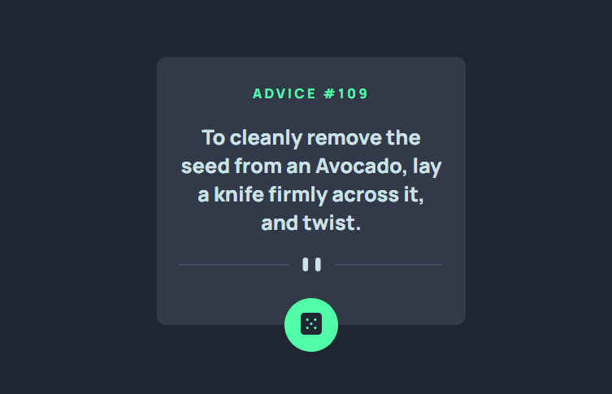

<h1 align="center">Advice Generator App</h1>

Projeto do Frontend Mentor, o Advice Geneeator App! Uma aplicaçÃo que gera conselhos aleátorios ao clicar no botão.
 

  <a href="#-tecnologias">Tecnologias</a>&nbsp;&nbsp;&nbsp;|&nbsp;&nbsp;&nbsp;
  <a href="#-projeto">Projeto</a>&nbsp;&nbsp;&nbsp;&nbsp;&nbsp;&nbsp;
  

 
  <h2 align= 'center'>Design</h2>
  

  
  

  
## 🚀 Tecnologias

Esse projeto foi desenvolvido com as seguintes tecnologias:

- HTML
- CSS
- Javascript
- API

## 💻 Projeto

Esse é o Advice Geneeator App!

- [Acesse o projeto finalizado, online](https://carlosherbertdev.github.io/advice-generator-app-main/)